  

## What I do

I administer Minecraft servers end to end, on the human side and on the technical side.

**People**
- Lead staff teams of guides, moderators, managers and admins
- Handle disputes, reports and sensitive cases
- Manage cash flow

**Tech**
- Server administration: plugins, economy, store
- Discord development and integration

## Minecraft servers

| Server | Role | Scale |
| --- | --- | --- |
| **SurvivalWorld** | Head admin and manager, 10 years | 200,000+ registered players |
| **Walyverse** (Astralya, Wynlord, Hyleaf) | Admin | 3 servers |

## Also

Moderator and admin for several large Discord, YouTube and Twitch communities (Discords of up to 90,000 members, live audiences of tens of thousands), and admin of a Discord Partner server.

  
  

## Contact

<!-- To fill in: your Discord, X, website... -->
- Discord: `Jaack_o`
